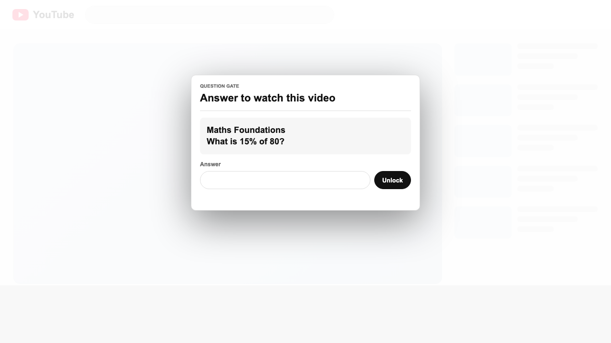
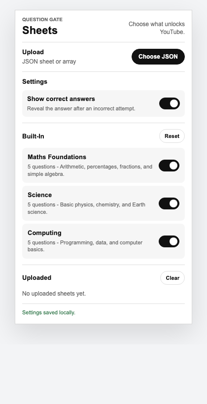

# YouTube Question Gate

A Chrome and Firefox extension that blocks YouTube until you answer a question. It asks again when you open a different video, Short, or embed.

## Screenshots





## Install

Download the latest release from GitHub.

### Chrome

1. Download `youtube-question-gate-<version>.zip`.
2. Unzip it.
3. Open `chrome://extensions`.
4. Enable `Developer mode`.
5. Click `Load unpacked`.
6. Select the unzipped folder.

### Firefox

For Firefox Developer Edition, Nightly, or ESR:

1. Open `about:config`.
2. Set `xpinstall.signatures.required` to `false`.
3. Download `youtube-question-gate-<version>.xpi`.
4. Open `about:addons`.
5. Click the gear button.
6. Choose `Install Add-on From File...`.
7. Select the `.xpi`.

Regular Firefox requires Mozilla-signed extensions for permanent file installs. For a temporary install, open `about:debugging#/runtime/this-firefox`, click `Load Temporary Add-on...`, and select `manifest.json` from the unzipped release folder.

## Features

- Blocks YouTube until the current page or video is unlocked.
- Includes 10 built-in question sheets across broad study topics.
- Supports uploaded JSON question sheets.
- Lets you enable, disable, upload, and delete sheets from the toolbar popup.
- Optionally hides correct answers after wrong attempts.
- Supports numbers, decimals, fractions such as `1/4`, and short text answers.
- Stores settings and uploaded sheets locally in browser extension storage.

## Build

No dependencies are required.

```sh
npm run validate
npm run package
```

`npm run package` creates:

- `dist/youtube-question-gate-<version>.zip`
- `dist/youtube-question-gate-<version>.xpi`

## Question Sheets

Question sheets are JSON files. Use `sample-sheet.json` as a starting point.

```json
{
  "schemaVersion": 1,
  "title": "Study Practice",
  "questions": [
    {
      "question": "What CSS property changes text color?",
      "answer": "color"
    },
    {
      "question": "What is P(all heads) for 3 fair coin flips?",
      "answer": "1/8",
      "tolerance": 0.005
    }
  ]
}
```

See `question-sheet.schema.json` for the full format.

## Privacy

YouTube Question Gate does not send uploaded sheets, answers, settings, or browsing data to a server. See `PRIVACY.md`.

## License

MIT. See `LICENSE`.
